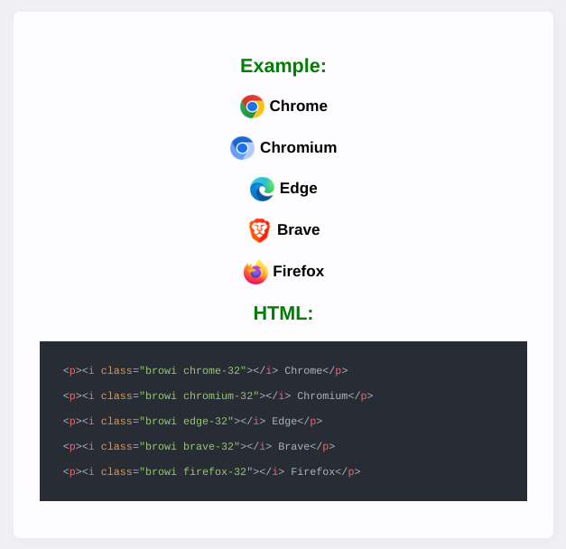

<div align="center">
  <h1>browser logos css<h1>
  
</div>

This project uses [Browser Logos][ogrepo] for the images and adds css for website icons

Examples
----------------

First include the main css file in your head element

```html
<head>
  <link rel="stylesheet" href="path/to/browser-logos.css">
</head>
```

Then use the ``i`` element with the class ``browi`` and your browser logo: 
```html
<p>Microsoft edge</p><i class="browi edge"></i>
```

Output:



Acknowledgements
----------------

[Browser Logos][ogrepo], by [alrra][ogcreator]

Legal
-----

All logos and trademarks are the property of their respective owners.

Everything else is available under the [MIT license][license].

<!-- Link labels: -->

[archive readme]: src/archive/README.md#readme
[license]: LICENSE
[creator]: https://github.com/oxmc
[repo]: https://github.com/oxmc/browser-logos-css
[ogcreator]: https://github.com/alrra
[ogrepo]: https://github.com/alrra/browser-logos/
[src readme]: src/README.md#readme
